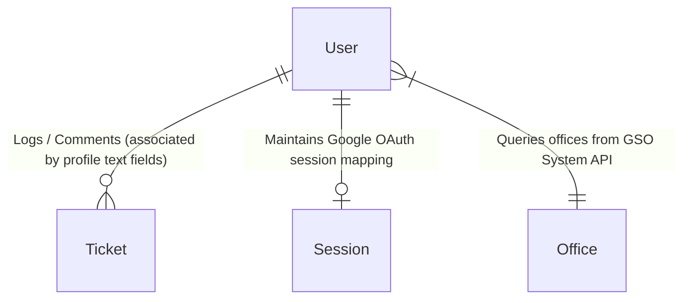

# DATABASE ANALYSIS REPORT

This report provides a detailed overview of the MongoDB database schema, Mongoose models, data relationships, collection fields, indexes, and data integrity configurations for the IT Helpdesk and integrated portal backend.

---

## 1. Mongoose Models & Collections Summary

The backend manages user accounts, sessions, and support ticket records.

| Collection Name | Mongoose Model | Description | Primary Key / Indexing |
| :--- | :--- | :--- | :--- |
| `users` | `User` | Portal user records containing registration details, status, password hashes, and OAuth link keys. | `email` (Unique), `employeeId` (Unique / Partial) |
| `tickets` | `Ticket` | IT support tickets storing descriptions, categories, comment timelines, and attachment directories. | `_id` (ObjectId) |
| `sessions` | `Session` (connect-mongo) | Storage used for serialized Passport.js Google login sessions. | `_id` (Session ID string) |

---

## 2. Collection Schemas in Detail

### 2.1 Users Collection (`users`)
Tracks employee account access credentials and permission scopes.
```javascript
const userSchema = new mongoose.Schema({
    employeeId: { type: String }, // Optional to support Google Sign-In
    employmentType: { type: String, required: true, default: 'Permanent' },
    name: { type: String, required: true },
    role: { type: String, required: true, default: 'Employee' }, // Employee, ICTO Staff, ICTO Head, Department Head
    office: { type: String, required: true, default: 'Unassigned' },
    email: { type: String, required: true, unique: true },
    password: { type: String }, // Present only for traditional credential signups
    googleId: { type: String }, // Google unique profile ID
    passwordResetToken: String,
    passwordResetExpires: Date,
    status: { type: String, required: true, default: 'Pending' } // Pending, Active, Rejected
}, { timestamps: true });
```
* **Indices**:
  - `{ email: 1 }` (Unique) — Prevents duplicate emails.
  - `{ employeeId: 1 }` (Unique, Partial) — Restricts duplicate employee IDs while allowing multiple null values for Google accounts:
    ```javascript
    userSchema.index(
        { employeeId: 1 }, 
        { unique: true, partialFilterExpression: { employeeId: { $type: 'string' } } }
    );
    ```

---

### 2.2 Tickets Collection (`tickets`)
Maintains logs of logged IT complaints.
```javascript
const commentSchema = new mongoose.Schema({
    author: String,
    content: String,
    attachmentUrl: String, // Cloudinary attachment links
    createdAt: { type: Date, default: Date.now }
});

const ticketSchema = new mongoose.Schema({
    subject: { type: String, required: true },
    description: { type: String, required: true },
    requesterName: { type: String, required: true },
    requesterRole: String,
    requesterOffice: String,
    category: String,
    subCategory: String,
    urgency: String,
    status: { type: String, default: 'New' }, // New, In Progress, Resolved, Closed
    createdAt: { type: Date, default: Date.now },
    comments: [commentSchema] // Array of nested comment subdocuments
});
```

---

## 3. Relationships & Data Flows

The data flow within the system operates on a denormalized model, with external interfaces to the GSO system.



### 3.1 Normalization vs Denormalization
1. **User Meta Duplication in Tickets**: The `Ticket` model duplicates requester details (`requesterName`, `requesterRole`, `requesterOffice`) instead of storing a referencing `ObjectId` back to `User`. This avoids database joins, but leaves historical ticket references stale if a user changes their profile information.
2. **GSO Office Proxy Flow**: During registration or profile edits, the portal queries LGU office configurations from the GSO system backend via a secure proxy:
   - **Data Flow**: Portal backend receives request (`GET /api/users/offices`) ➔ calls GSO backend (`GET /api/offices/public`) via `fetch` with an `X-Internal-API-Key` ➔ GSO returns office arrays ➔ Portal proxy returns list to frontend client dropdown.
3. **Passport Sessions vs JWT Auth**: Standard logins bypass database sessions, placing signed JWTs into `portalAuthToken` cookies. Google OAuth logins set a `connect.sid` cookie, which is verified against persistent records inside the `sessions` collection.
