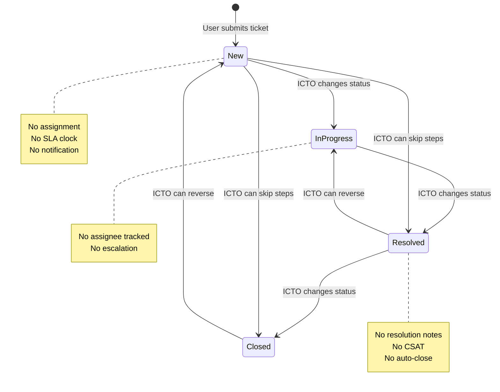

# IT HELPDESK FUNCTIONAL MATURITY ASSESSMENT
# LGU Daet IT Service Management Platform Evaluation

**Assessment Date:** June 24, 2026
**Assessor Role:** Senior ITSM Consultant, Service Desk Architect, IT Operations Manager, Enterprise Architect
**Assessment Scope:** IT Helpdesk platform capabilities only — Identity/IAM assessed separately
**Framework Reference:** ITIL 4, HDI Support Center Maturity Model

---

## Executive Summary

The IT Helpdesk System functions as a **basic ticket logging and tracking tool**. It successfully allows employees to submit support requests, enables ICTO staff to manage ticket status, and provides a conversation thread with file attachments. The user interface is modern, responsive, and well-built.

However, when evaluated against IT Service Management (ITSM) standards, the system is at **Level 1 (Reactive)** on a 5-level maturity scale. It lacks the fundamental ITSM workflows, automation, assignment logic, SLA tracking, knowledge management, and operational reporting capabilities that define a functional IT service desk.

The system is currently a **ticket logger**, not a **service management platform**. This distinction is critical: it records problems but does not manage the process of resolving them.

> [!IMPORTANT]
> The system does one thing well: it lets users submit tickets and ICTO staff communicate on them. But the gap between "ticket logging" and "IT Service Management" is where all the operational value lives — assignment, escalation, SLAs, knowledge base, and performance measurement. None of these exist today.

---

## Scorecard Summary

| Dimension | Score | Verdict |
|:---|:---:|:---|
| **Helpdesk Maturity** | **3.5 / 10** | Basic ticket logging with manual workflows; no automation |
| **ITSM Maturity** | **2.0 / 10** | No ITIL process implementation; single undifferentiated ticket type |
| **Operational Maturity** | **3.5 / 10** | Managed hosting provides basics; no helpdesk-specific ops |
| **User Experience** | **6.0 / 10** | Clean, modern UI; good submission flow; weak self-service |
| **Reporting & Analytics** | **2.5 / 10** | Status counters only; no performance, trend, or SLA reports |
| **Overall Helpdesk** | **3.5 / 10** | A clean ticket logger that needs ITSM bones |

```
Helpdesk Maturity     ███████░░░░░░░░░░░░░  3.5/10
ITSM Maturity         ████░░░░░░░░░░░░░░░░  2.0/10
Operational Maturity  ███████░░░░░░░░░░░░░  3.5/10
User Experience       ████████████░░░░░░░░  6.0/10
Reporting & Analytics █████░░░░░░░░░░░░░░░  2.5/10
──────────────────────────────────────────────────
OVERALL HELPDESK      ███████░░░░░░░░░░░░░  3.5/10
```

---

## 1. Ticket Management

### 1.1 Ticket Creation

**Status: ✅ Functional — well implemented for a basic system**

The [NewTicket.tsx](file:///d:/Programming/_ITHELPDESK/frontend/src/pages/NewTicket.tsx) form captures:

| Field | Implementation | Assessment |
|:---|:---|:---|
| Category | ✅ Dropdown (Hardware, Software, Network, Printer, Account) | Good — LGU-relevant categories |
| Sub-Category | ✅ Dynamic dropdown based on category | Good — cascading selection |
| Priority | ✅ Dropdown (Low, Medium, High) | ⚠️ User-set priority — should be technician-set or auto-calculated |
| Subject | ✅ Free text | Good |
| Description | ✅ Textarea | Good |
| Requester Info | ✅ Auto-populated from session (name, role, office) | Good — no manual requester entry |

**Strengths:**
- Categories map well to LGU IT support needs (biometrics machines, e-Tax, ECPAC)
- Sub-categories provide helpful specificity (23 sub-categories across 5 categories)
- Auto-population of requester info reduces data entry errors

**Weaknesses:**
- No file attachment on initial ticket creation (only on comments)
- No "on behalf of" submission capability — Department Heads can't log tickets for their staff
- Priority is self-selected by the user, not calculated from urgency + impact
- No ticket templates for common requests
- No required field for affected device/location

### 1.2 Categorization

**Status: ⚠️ Hardcoded — functional but not manageable**

Categories and sub-categories are **hardcoded in the frontend** as a static JavaScript map:

```typescript
// NewTicket.tsx L7-13
const subCategoriesMap: Record<string, string[]> = {
  Hardware: ['Laptop/Desktop Issue', 'Monitor/Peripherals', 'Biometrics Machine', ...],
  Software: ['MS Office', 'Operating System', 'Antivirus', 'e-Tax System', ...],
  Network: ['No Internet Connection', 'Slow Connection', 'Wi-Fi Access', ...],
  Printer: ['Not Printing', 'Paper Jam', 'Toner/Ink Replacement', ...],
  Account: ['Password Reset', 'New Account Request', 'Permission Issue']
};
```

| Capability | Status |
|:---|:---:|
| Category selection | ✅ Exists |
| Sub-category selection | ✅ Exists |
| Admin-managed categories | ❌ Hardcoded in frontend |
| Category-based auto-routing | ❌ Missing |
| Category-based SLA assignment | ❌ Missing |
| Category analytics | ❌ Not tracked in backend queries |
| Multi-level categorization (3+ levels) | ❌ Only 2 levels |

> [!NOTE]
> The category model is stored in the ticket but **never queried by the analytics backend**. The [analytics.controller.ts](file:///d:/Programming/_ITHELPDESK/backend/src/features/analytics/analytics.controller.ts) only counts by status — it never aggregates by category, sub-category, office, or time period. The categorization data is captured but never used.

### 1.3 Prioritization

**Status: ❌ Non-functional**

The frontend form includes a priority field (Low/Medium/High), and it's sent in the request body. However:

- The [ticket.model.ts](file:///d:/Programming/_ITHELPDESK/backend/src/features/tickets/ticket.model.ts) schema uses `urgency: String` — not `priority`
- The field is stored but **never used anywhere**: not in queries, not in sorting, not in display logic, not in the ticket list UI
- The [Tickets.tsx](file:///d:/Programming/_ITHELPDESK/frontend/src/pages/Tickets.tsx) list page doesn't display priority
- The [TicketDetails.tsx](file:///d:/Programming/_ITHELPDESK/frontend/src/pages/TicketDetails.tsx) detail page doesn't display priority
- No priority-based sorting, filtering, or visual indicators exist

**Verdict:** Priority is a phantom field — collected but invisible and unused.

### 1.4 Assignment

**Status: ❌ Completely missing**

| Capability | Status | Detail |
|:---|:---:|:---|
| Assign ticket to technician | ❌ Missing | No `assignedTo` field on ticket model |
| Technician work queue | ❌ Missing | No "My Assigned Tickets" view |
| Auto-assignment rules | ❌ Missing | No routing based on category/office |
| Assignment history | ❌ Missing | No record of reassignments |
| Workload balancing | ❌ Missing | No visibility into technician ticket counts |
| Team/group assignment | ❌ Missing | No support groups or teams concept |

> [!CAUTION]
> **This is the most critical helpdesk gap.** Without ticket assignment, there is no way to know *who is working on what*. ICTO staff must informally coordinate ("I'll take this one") with no system record. This makes workload management, performance tracking, and accountability impossible.

### 1.5 Escalation

**Status: ❌ Completely missing**

| Capability | Status |
|:---|:---:|
| Manual escalation (L1 → L2 → L3) | ❌ Missing |
| Time-based auto-escalation | ❌ Missing |
| Escalation notifications | ❌ Missing |
| Escalation history | ❌ Missing |
| Escalation to external vendors | ❌ Missing |

### 1.6 Resolution

**Status: ⚠️ Partial — status-only**

Resolution is handled by ICTO staff changing the ticket status to "Resolved" via the admin panel in [TicketDetails.tsx](file:///d:/Programming/_ITHELPDESK/frontend/src/pages/TicketDetails.tsx#L249-L278). However:

| Capability | Status | Detail |
|:---|:---:|:---|
| Status change to Resolved | ✅ Exists | Admin dropdown → "Resolved" |
| Resolution notes | ❌ Missing | No dedicated resolution summary field |
| Resolution categorization | ❌ Missing | No "root cause" or "resolution type" |
| Resolution time tracking | ❌ Missing | No `resolvedAt` timestamp |
| User satisfaction survey | ❌ Missing | No CSAT/feedback collection |
| Reopen mechanism | ⚠️ Manual | Admin can change status back to "In Progress" — no user-initiated reopen |

### 1.7 Closure

**Status: ⚠️ Minimal**

| Capability | Status | Detail |
|:---|:---:|:---|
| Status change to Closed | ✅ Exists | Admin can set status to "Closed" |
| Auto-close after resolution | ❌ Missing | No timer to auto-close resolved tickets |
| Closure confirmation from user | ❌ Missing | User cannot confirm resolution or reject it |
| Closed ticket reopening rules | ❌ Missing | No business rules on reopening closed tickets |

### 1.8 Ticket Lifecycle Summary



> [!WARNING]
> The ticket lifecycle has **no guardrails**. Any ICTO user can set any ticket to any status at any time, including regressing from Closed back to New. There are no business rules, no required fields per transition, and no audit trail of who changed the status.

---

## 2. ITSM Workflow Maturity

### 2.1 Incident Management

| ITIL Requirement | Status | Detail |
|:---|:---:|:---|
| Incident detection & logging | ✅ Exists | User-submitted tickets |
| Incident categorization | ✅ Exists | Category + sub-category |
| Incident prioritization | ❌ Phantom | Field exists but unused |
| Incident assignment | ❌ Missing | No `assignedTo` |
| Incident investigation & diagnosis | ⚠️ Comments only | Conversation thread serves as investigation log |
| Incident resolution & recovery | ⚠️ Status only | No resolution details captured |
| Incident closure | ✅ Exists | Manual closure by ICTO |
| Major incident process | ❌ Missing | No severity levels, no major incident flag |

**ITIL Incident Management Maturity: Level 1 (Initial/Ad Hoc)**

### 2.2 Service Request Management

**Status: ❌ Not differentiated**

The system makes no distinction between:
- **Incidents** (something is broken — "printer not working")
- **Service Requests** (I need something — "new account request", "initial setup")

Both are logged as the same ticket type. The "Account" category contains service requests ("New Account Request", "Permission Issue") mixed alongside the incident categories.

| Capability | Status |
|:---|:---:|
| Service request vs. incident differentiation | ❌ Missing |
| Service request catalog | ❌ Missing |
| Predefined service request forms | ❌ Missing |
| Service request approval workflows | ❌ Missing |
| Service request fulfillment tracking | ❌ Missing |

### 2.3 Problem Management

**Status: ❌ Not implemented**

No ability to:
- Link multiple incidents to a common root cause
- Create problem records
- Track known errors
- Document workarounds
- Perform root cause analysis

### 2.4 Change Management

**Status: ❌ Not implemented**

No ability to:
- Submit change requests
- Track change approval workflows
- Schedule maintenance windows
- Record change implementation results
- Link changes to incidents they caused

### 2.5 Service Catalog Readiness

**Status: ❌ Not implemented**

The sub-category map in `NewTicket.tsx` is the closest thing to a service catalog, but it's a hardcoded frontend dropdown, not a manageable catalog of IT services with descriptions, SLAs, and request forms.

---

## 3. Technician Experience

### 3.1 Current Technician Workflow

An ICTO technician's workflow in the current system:

1. Navigate to "All Tickets" page
2. Manually scan the list for new tickets
3. Click into a ticket to read details
4. Post a comment asking for more information
5. Mentally remember which tickets they're working on
6. Change status when done
7. No record of who worked on what

### 3.2 Assessment

| Capability | Status | Detail |
|:---|:---:|:---|
| "My Tickets" / work queue | ❌ Missing | All ICTO see all tickets — no personal queue |
| Ticket assignment to self | ❌ Missing | No "Take ownership" button |
| Quick status update from list | ❌ Missing | Must drill into each ticket to change status |
| Internal notes (not visible to requester) | ❌ Missing | All comments are visible to all parties |
| Canned/template responses | ❌ Missing | Technicians type every response from scratch |
| Time logging per ticket | ❌ Missing | No way to record hours worked |
| Bulk actions | ❌ Missing | Cannot close/assign multiple tickets at once |
| Ticket merging | ❌ Missing | Cannot merge duplicate submissions |
| Related tickets linking | ❌ Missing | Cannot link related issues |
| Keyboard shortcuts | ❌ Missing | No productivity shortcuts |

### 3.3 Collaboration

| Capability | Status | Detail |
|:---|:---:|:---|
| Comment thread | ✅ Exists | Both requester and technician can post |
| File attachments on comments | ✅ Exists | Cloudinary-backed uploads |
| @mentions | ❌ Missing | Cannot tag specific team members |
| Internal (private) notes | ❌ Missing | All comments visible to requester |
| Email-to-ticket integration | ❌ Missing | Cannot create or reply to tickets via email |

> [!IMPORTANT]
> The absence of **internal notes** is a significant gap. Technicians cannot discuss sensitive information (e.g., "this user has a history of damaging equipment" or "waiting for budget approval for replacement") without the requester seeing it.

---

## 4. SLA Management

### 4.1 Current State

**Status: ❌ Completely absent**

There is zero SLA infrastructure in the system:

| Capability | Status |
|:---|:---:|
| SLA policy definitions | ❌ Missing |
| Response time targets | ❌ Missing |
| Resolution time targets | ❌ Missing |
| First response tracking | ❌ Missing |
| SLA clock (start/pause/stop) | ❌ Missing |
| Business hours configuration | ❌ Missing |
| SLA breach alerting | ❌ Missing |
| SLA breach escalation | ❌ Missing |
| SLA compliance reporting | ❌ Missing |
| SLA dashboard | ❌ Missing |

### 4.2 Impact

Without SLA tracking, it is impossible to answer:
- "How long does it take to resolve a network issue on average?"
- "How many tickets breached the 24-hour response target this month?"
- "Which category has the worst resolution times?"
- "Is our service desk performance improving or degrading?"

These are the questions that ICTO leadership, the Municipal Administrator, and the Mayor's office need answered to justify IT staffing and budget.

### 4.3 Recommended SLA Targets for LGU Context

| Priority | First Response | Resolution Target |
|:---|:---|:---|
| Critical (system down, biometrics offline) | 30 minutes | 4 business hours |
| High (single user blocked) | 1 hour | 8 business hours |
| Medium (degraded service) | 4 hours | 2 business days |
| Low (cosmetic, enhancement) | 1 business day | 5 business days |

---

## 5. Notifications

### 5.1 Current State

| Notification Event | Triggered? | Channel | Recipient |
|:---|:---:|:---:|:---|
| New ticket submitted | ❌ No | — | Requester gets no confirmation |
| Ticket assigned | N/A | — | Assignment doesn't exist |
| Status changed | ❌ No | — | Requester not notified |
| New comment posted | ❌ No | — | Neither party notified |
| Ticket resolved | ❌ No | — | Requester not notified |
| SLA about to breach | N/A | — | SLA doesn't exist |
| User registration approved | ✅ Yes | Email | User |
| User registration rejected | ✅ Yes | Email | User |
| New registration pending | ✅ Yes | Email | Admin |

> [!CAUTION]
> **The helpdesk has zero ticket-related notifications.** When a user submits a ticket, they receive no confirmation. When ICTO resolves it, the user receives no notification. Users must manually check the dashboard to see if their ticket has been updated. This is a fundamental user experience failure for a service desk.

### 5.2 The notification infrastructure exists — but isn't used for helpdesk

The system has a working email service ([email.service.ts](file:///d:/Programming/_ITHELPDESK/backend/src/services/email.service.ts)) and cross-system notification API ([internal.controller.ts](file:///d:/Programming/_ITHELPDESK/backend/src/features/internal/internal.controller.ts)), but these are only used for account lifecycle emails, not for ticket events.

---

## 6. Reporting & Analytics

### 6.1 Current Analytics Capabilities

The [Analytics.tsx](file:///d:/Programming/_ITHELPDESK/frontend/src/pages/Analytics.tsx) page provides:

- ✅ Total ticket count
- ✅ Count by status (New, In Progress, Resolved, Closed)
- ✅ Doughnut chart visualization
- ✅ Chart export to PNG

The [Dashboard.tsx](file:///d:/Programming/_ITHELPDESK/frontend/src/pages/Dashboard.tsx) provides:

- ✅ Role-scoped summary stats (4 counters)
- ✅ Recent tickets list with pagination

### 6.2 What's Missing

| Report Type | Status | Why It Matters |
|:---|:---:|:---|
| **Tickets by category** | ❌ Missing | Where are most issues coming from? |
| **Tickets by department/office** | ❌ Missing | Which offices generate the most tickets? |
| **Tickets over time (trend)** | ❌ Missing | Are ticket volumes increasing? |
| **Average resolution time** | ❌ Missing | How fast are we resolving issues? (No `resolvedAt` timestamp) |
| **First response time** | ❌ Missing | How quickly do we acknowledge issues? |
| **Technician performance** | ❌ Missing | Who resolved the most tickets? (No assignment) |
| **SLA compliance** | ❌ Missing | Are we meeting our targets? (No SLA) |
| **Backlog aging** | ❌ Missing | How old are our open tickets? |
| **Reopen rate** | ❌ Missing | How often do resolved tickets come back? |
| **Category resolution time** | ❌ Missing | Which issue types take longest to fix? |
| **Monthly/quarterly summary** | ❌ Missing | Executive-level periodic reports |
| **Export to CSV/PDF** | ⚠️ Chart PNG only | Cannot export ticket data for reporting |

### 6.3 Backend Analytics API Limitation

The analytics API ([analytics.controller.ts](file:///d:/Programming/_ITHELPDESK/backend/src/features/analytics/analytics.controller.ts)) runs 4-5 `countDocuments()` queries:

```typescript
const [totalTickets, newTickets, inProgressTickets, resolvedTickets, closedTickets] = await Promise.all([
    Ticket.countDocuments(),
    Ticket.countDocuments({ status: 'New' }),
    Ticket.countDocuments({ status: 'In Progress' }),
    Ticket.countDocuments({ status: 'Resolved' }),
    Ticket.countDocuments({ status: 'Closed' })
]);
```

This is the entire analytics capability. No aggregation pipelines, no date ranges, no grouping by category/office/technician, no time-series data.

---

## 7. Knowledge Base Readiness

### 7.1 Current State

**Status: ❌ Completely absent**

| Capability | Status |
|:---|:---:|
| Knowledge base articles | ❌ Missing |
| Solution categorization | ❌ Missing |
| Article search | ❌ Missing |
| Link articles to tickets | ❌ Missing |
| Self-service portal | ❌ Missing |
| FAQ page | ❌ Missing |
| Common issue documentation | ❌ Missing |
| Ticket deflection measurement | ❌ Missing |

### 7.2 Ticket Deflection Opportunities

Based on the sub-categories, many common issues could be resolved through knowledge articles instead of tickets:

| Category | Potential KB Articles | Deflection Potential |
|:---|:---|:---:|
| Network → No Internet Connection | "How to troubleshoot network connectivity" | High |
| Network → Wi-Fi Access | "How to connect to LGU Wi-Fi" | High |
| Printer → Paper Jam | "How to clear a paper jam" | High |
| Software → MS Office | "Common MS Office fixes" | Medium |
| Account → Password Reset | Self-service password reset exists | Already deflected |
| Printer → Toner/Ink Replacement | "How to request toner replacement" | Medium |

**Estimated deflection rate with KB:** 15-25% of tickets could be resolved through self-service.

---

## 8. Asset Management Integration Readiness

### 8.1 Current State

**Status: ❌ No integration**

| Capability | Status | Detail |
|:---|:---:|:---|
| Asset field on ticket | ❌ Missing | No way to specify which device/asset the ticket is about |
| Asset lookup during ticket creation | ❌ Missing | Cannot search/select assets from PPEMS |
| Asset-ticket history | ❌ Missing | Cannot see "all tickets for this printer" |
| Asset auto-population | ❌ Missing | No user-to-asset mapping |
| PPEMS API integration | ❌ Missing | No API contract with GSO/PPEMS system |

### 8.2 PPEMS Integration Readiness Assessment

For future PPEMS integration, the ticket model would need:

```typescript
// Required additions to ticket schema
assetId?: string;         // Reference to PPEMS asset
assetTag?: string;        // Physical QR tag number
assetDescription?: string; // "Dell Latitude 5520 - SN: ABC123"
location?: string;         // Physical location of the asset
```

**Current PPEMS system status:** The PPEMS/GSO system is a separate application at `lgudaet-gso-system.netlify.app`. The helpdesk already has SSO integration with GSO but no data-level integration for asset references.

---

## 9. Operational Maturity

*Evaluated from a helpdesk operations perspective, not infrastructure.*

| Capability | Status | Detail |
|:---|:---:|:---|
| **Ticket data backup** | ✅ MongoDB Atlas | Automatic backups via Atlas managed service |
| **System availability** | ⚠️ Render.com | Cold starts possible on free/starter tier |
| **Request logging** | ⚠️ Morgan (dev) | HTTP request logging, but only in dev mode |
| **Error tracking** | ❌ Console only | No Sentry or structured error tracking |
| **Health monitoring** | ❌ Missing | No health check endpoint |
| **Uptime monitoring** | ❌ Missing | No external monitoring |
| **Performance metrics** | ❌ Missing | No response time tracking |
| **Database query optimization** | ⚠️ Basic indexes | `email` and `employeeId` indexed; no ticket query optimization |
| **Scheduled maintenance** | ❌ Missing | No maintenance window concept |
| **Data retention policy** | ❌ Missing | Tickets stored indefinitely |
| **Disaster recovery** | ⚠️ Atlas provides | Point-in-time recovery via Atlas, but no documented DR procedure |

---

## 10. Gap Analysis

### Critical Gaps (Blocks basic service desk operation)

| # | Gap | Impact | Effort |
|:---|:---|:---|:---:|
| G1 | **No ticket assignment** | Cannot track who's working on what; no accountability | Medium |
| G2 | **No ticket notifications** | Users don't know their ticket was updated; manual checking required | Medium |
| G3 | **Priority field is non-functional** | Collected but never displayed or used; urgency has no meaning | Low |
| G4 | **No internal (private) notes** | Technicians can't discuss sensitive info without requester seeing it | Low |
| G5 | **No resolution details capture** | No root cause, no resolution notes, no `resolvedAt` timestamp | Low |
| G6 | **Ticket scoping by `requesterName` string** | Name collisions leak data; name changes break access (CTO audit finding) | Medium |

### High-Impact Gaps (Required for ITSM maturity)

| # | Gap | Impact | Effort |
|:---|:---|:---|:---:|
| G7 | **No SLA tracking** | Cannot measure service performance; no escalation triggers | High |
| G8 | **No category-based analytics** | Category data collected but never analyzed | Low |
| G9 | **No time-series reporting** | Cannot identify trends or seasonal patterns | Medium |
| G10 | **No technician performance metrics** | Cannot measure individual or team productivity | Medium |
| G11 | **Categories hardcoded in frontend** | Adding/modifying categories requires code deployment | Medium |
| G12 | **No ticket templates** | Common requests require full manual entry every time | Medium |
| G13 | **No ticket status audit trail** | No record of who changed status, when, or why | Low |
| G14 | **Ticket lifecycle has no guardrails** | Any status can transition to any other status | Low |

### Medium-Impact Gaps (Service improvement opportunities)

| # | Gap | Impact | Effort |
|:---|:---|:---|:---:|
| G15 | **No knowledge base** | Every repeat issue requires a new ticket | High |
| G16 | **No incident vs. service request differentiation** | Cannot measure or manage different request types | Medium |
| G17 | **No file attachment on initial ticket** | Users must submit, then comment to add a screenshot | Low |
| G18 | **No email notifications on ticket events** | Existing email infra unused for helpdesk events | Medium |
| G19 | **No canned/template responses** | Technicians retype common replies | Low |
| G20 | **No data export capability** | Cannot generate reports for management (only PNG chart) | Medium |
| G21 | **No "on behalf of" ticket submission** | Department Heads can't file tickets for their staff | Low |
| G22 | **No bulk ticket operations** | Cannot close 20 resolved tickets at once | Low |

### Future-Readiness Gaps

| # | Gap | Impact | Effort |
|:---|:---:|:---:|:---:|
| G23 | No asset field on tickets | Blocks PPEMS integration | Low |
| G24 | No ticket-to-problem linking | Blocks Problem Management | Medium |
| G25 | No change request workflow | Blocks Change Management | High |
| G26 | No service catalog | Blocks Service Request Management | High |
| G27 | No user satisfaction survey | Blocks CSAT measurement | Medium |
| G28 | No email-to-ticket creation | Blocks email channel support | High |

---

## Phased Roadmap: From Ticket Logger to LGU ITSM Platform

### Phase 1: Make the Helpdesk Functional (Weeks 1-4)

**Goal:** Close the gaps that prevent basic service desk operations.

**Theme:** "Know who's doing what and tell people when things change."

| # | Task | Addresses | Effort |
|:---|:---|:---:|:---:|
| 1.1 | **Add `assignedTo` field to ticket model** — Reference to ICTO user. Add "Assign to Me" / "Assign to" UI on ticket detail page. Add "My Tickets" filter on ticket list. | G1 | 2-3 days |
| 1.2 | **Fix ticket scoping** — Add `requesterId` field. Filter by user ID, not name string. Migrate existing tickets. | G6 | 1-2 days |
| 1.3 | **Activate priority field** — Display priority badge on ticket list and detail pages. Add priority filter. Map `urgency` schema field to match frontend `priority` field name. | G3 | 1 day |
| 1.4 | **Add ticket lifecycle timestamps** — `firstResponseAt`, `resolvedAt`, `closedAt` fields on ticket model. Set automatically on status transitions. | G5, G7 | 1 day |
| 1.5 | **Add resolution notes** — Required text field when changing status to "Resolved". Stored as `resolutionNotes` on ticket. | G5 | 1 day |
| 1.6 | **Add status transition rules** — Define valid transitions (e.g., New → In Progress → Resolved → Closed). Prevent skipping or backward movement without override flag. | G14 | 1 day |
| 1.7 | **Add ticket event notifications** — Email requester on: ticket acknowledged, status changed, new comment by ICTO. Email assigned ICTO on: new comment by requester. Use existing Brevo service. | G2, G18 | 2-3 days |
| 1.8 | **Add internal notes capability** — Boolean `isInternal` flag on comment schema. Internal comments visible only to ICTO roles. | G4 | 1 day |
| 1.9 | **Add status change audit trail** — Log `{ changedBy, oldStatus, newStatus, timestamp }` in a `statusHistory` array on the ticket. | G13 | 1 day |

**Deliverable:** A helpdesk where tickets are assigned, tracked, and notify users — the minimum viable service desk.

---

### Phase 2: Measure What Matters (Weeks 5-10)

**Goal:** Build the reporting and performance measurement layer.

**Theme:** "You can't improve what you don't measure."

| # | Task | Addresses | Effort |
|:---|:---|:---:|:---:|
| 2.1 | **Build analytics aggregation pipeline** — Replace `countDocuments()` with MongoDB aggregation. Group by: category, office, time period, assignee, priority. | G8, G9, G10 | 3-4 days |
| 2.2 | **Add SLA policy engine** — Define SLA targets per priority level. Calculate response and resolution compliance based on lifecycle timestamps. Flag breached tickets. | G7 | 3-5 days |
| 2.3 | **Build operational reports page** — Tickets by category chart. Tickets by office chart. Tickets over time (monthly trend). Average resolution time by category. | G8, G9 | 3-4 days |
| 2.4 | **Build technician performance dashboard** — Tickets assigned/resolved per technician. Average resolution time per technician. Workload distribution. | G10 | 2-3 days |
| 2.5 | **Add CSV data export** — Export filtered ticket lists to CSV for management reporting. | G20 | 1-2 days |
| 2.6 | **Add ticket templates** — Admin-managed common templates (e.g., "Printer Setup Request", "Network Access Request") that pre-fill category, sub-category, and description template. | G12 | 2-3 days |
| 2.7 | **Move categories to database** — Create `categories` collection. Admin CRUD for categories and sub-categories. Frontend fetches from API instead of hardcoded map. | G11 | 2-3 days |
| 2.8 | **Add initial file attachment on ticket creation** — Allow file upload on the new ticket form, not just comments. | G17 | 1 day |

**Deliverable:** A measurable service desk with SLA tracking, category analytics, performance dashboards, and data export.

---

### Phase 3: ITSM Foundations (Months 3-6)

**Goal:** Introduce ITIL-aligned process differentiation and self-service.

**Theme:** "From ticket logging to service management."

| # | Task | Addresses | Effort |
|:---|:---|:---:|:---:|
| 3.1 | **Differentiate incidents vs. service requests** — Add `ticketType` field (Incident / Service Request). Different forms, different SLA targets, different reporting. | G16 | 2-3 days |
| 3.2 | **Build basic knowledge base** — Article model (title, content, category, tags). Search page. Link articles to ticket categories. "Suggested articles" shown during ticket creation. | G15 | 1-2 weeks |
| 3.3 | **Add CSAT survey** — After ticket resolution, email a satisfaction survey link. 1-5 star rating + optional comment. Track per-technician and per-category CSAT. | G27 | 3-4 days |
| 3.4 | **Add canned responses** — ICTO-managed response templates. Quick-insert into comment form. | G19 | 1-2 days |
| 3.5 | **Add asset field to tickets** — Optional `assetTag` and `assetDescription` fields. Manual entry initially; API lookup from PPEMS when available. | G23 | 1-2 days |
| 3.6 | **Add escalation rules** — Time-based escalation: if ticket stays in "New" for >X hours, notify ICTO Head. If SLA is at 80% of target, escalate. | G7 | 2-3 days |
| 3.7 | **"On behalf of" ticket submission** — Department Heads and ICTO can submit tickets on behalf of other employees. | G21 | 1-2 days |
| 3.8 | **Executive summary dashboard** — Monthly ticket volume, SLA compliance %, CSAT score, top categories, top offices. Designed for the Municipal Administrator / Mayor's office. | G9 | 2-3 days |

**Deliverable:** An ITIL-aligned service desk with knowledge base, CSAT measurement, asset tracking readiness, and executive reporting.

---

### Phase 4: Service Maturity (Months 6-12)

**Goal:** Advanced ITSM capabilities for a mature LGU IT operation.

| # | Task | Addresses | Effort |
|:---|:---|:---:|:---:|
| 4.1 | **Build service catalog** — Formal list of IT services offered by ICTO with descriptions, SLAs, and request forms. | G26 | 2-3 weeks |
| 4.2 | **Problem Management** — Problem record linking multiple incidents. Root cause analysis fields. Known error database. | G24 | 1-2 weeks |
| 4.3 | **PPEMS asset integration** — API integration to look up assets from PPEMS during ticket creation. Show ticket history for an asset. | G23 | 1-2 weeks |
| 4.4 | **Email-to-ticket channel** — Receive tickets via email. Auto-create tickets from incoming email. Reply by email. | G28 | 2-3 weeks |
| 4.5 | **Change Management** — Change request workflow with approval, scheduling, and post-implementation review. | G25 | 2-3 weeks |
| 4.6 | **Bulk operations** — Multi-select tickets for bulk status change, bulk assignment, bulk close. | G22 | 2-3 days |
| 4.7 | **Auto-assignment rules** — Route tickets based on category (e.g., Network tickets → Network technician, Printer tickets → Printer technician). | G1 | 2-3 days |

**Deliverable:** A mature LGU ITSM platform with service catalog, problem management, asset integration, and multi-channel support.

---

## Maturity Model Progression

```
Level 5 ─ Optimized    ░░░░░░░░░░░░░░░░  Continuous improvement, predictive
Level 4 ─ Managed      ░░░░░░░░░░░░░░░░  SLA-driven, measured, data-informed
Level 3 ─ Defined      ░░░░░░░░░░░░░░░░  ITIL processes, KB, CSAT  ← Phase 3-4 target
Level 2 ─ Repeatable   ░░░░░░░░░░░░░░░░  Assignment, tracking, reporting  ← Phase 1-2 target
Level 1 ─ Reactive     ████████████████  Log and respond  ← CURRENT STATE
```

| Phase | Target Level | Key Indicator |
|:---|:---|:---|
| After Phase 1 | **Level 2 (Repeatable)** | Every ticket has an owner, every change is notified |
| After Phase 2 | **Level 2.5** | SLA tracking, category analytics, performance dashboards |
| After Phase 3 | **Level 3 (Defined)** | ITIL processes, knowledge base, CSAT, asset integration |
| After Phase 4 | **Level 3.5-4 (Managed)** | Service catalog, problem management, multi-channel |

---

## Appendix: Positive Findings

Despite the low ITSM maturity score, several aspects of the system are well-executed and should be preserved:

| Strength | Detail |
|:---|:---|
| **Clean, modern UI** | The React + TailwindCSS + DaisyUI frontend is polished, responsive, and professional |
| **Category taxonomy** | The 5 categories with 23 sub-categories are well-chosen for LGU IT support |
| **Role-scoped visibility** | Employees see their tickets, Dept Heads see their office, ICTO sees all — this is correct ITSM scoping |
| **Conversation thread** | The comment + attachment system provides good collaboration basics |
| **Pagination** | Server-side pagination on ticket lists prevents performance issues at scale |
| **Search with debounce** | The 300ms debounce on search is a good UX practice |
| **Chart export** | The ability to export the doughnut chart as PNG is a nice touch |
| **Delete confirmation** | The name-typing confirmation for user deletion is a good safety mechanism |
| **Notification infrastructure** | The Brevo email service + notification logging + cross-system API is a solid foundation to build on |

---

*Assessment prepared by Antigravity AI — acting as Senior ITSM Consultant, Service Desk Architect, IT Operations Manager, and Enterprise Architect for LGU Daet ICTO.*
